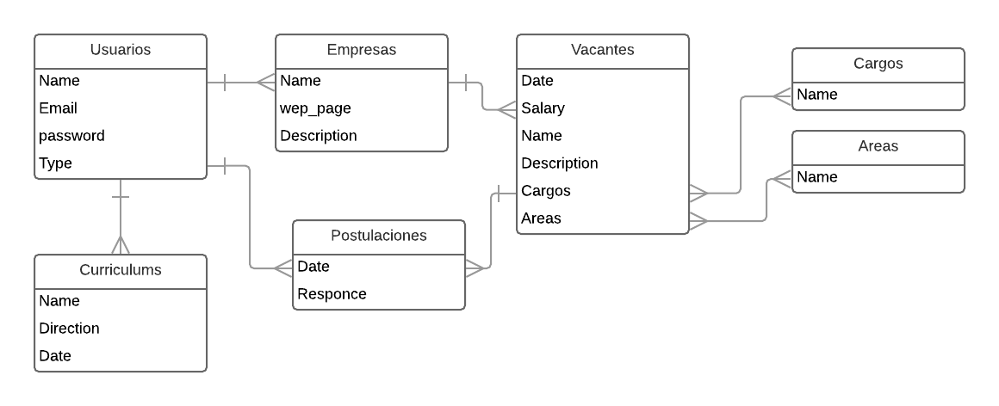
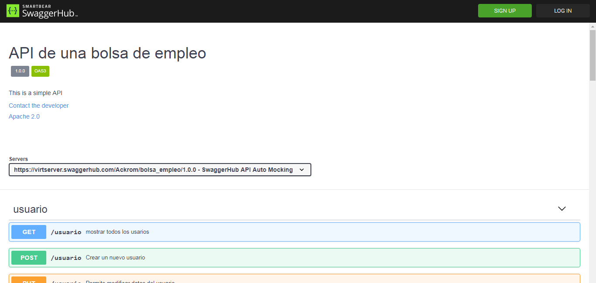
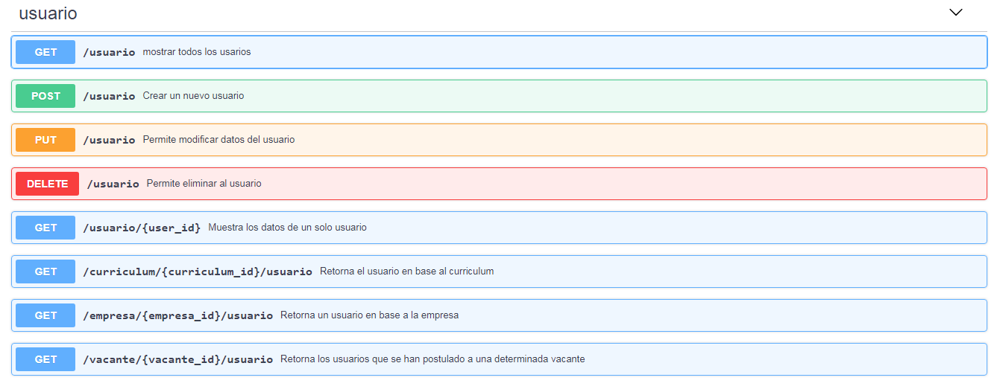
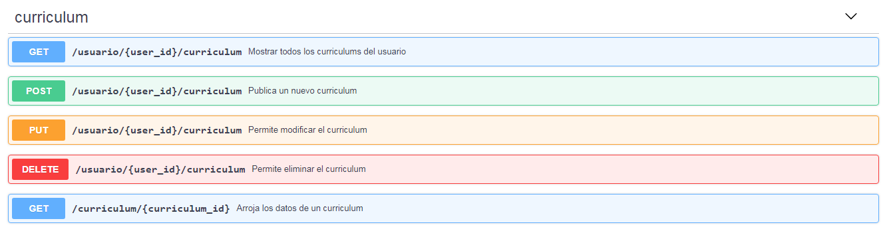
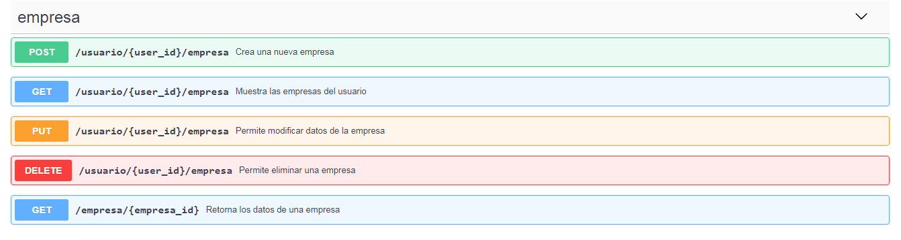
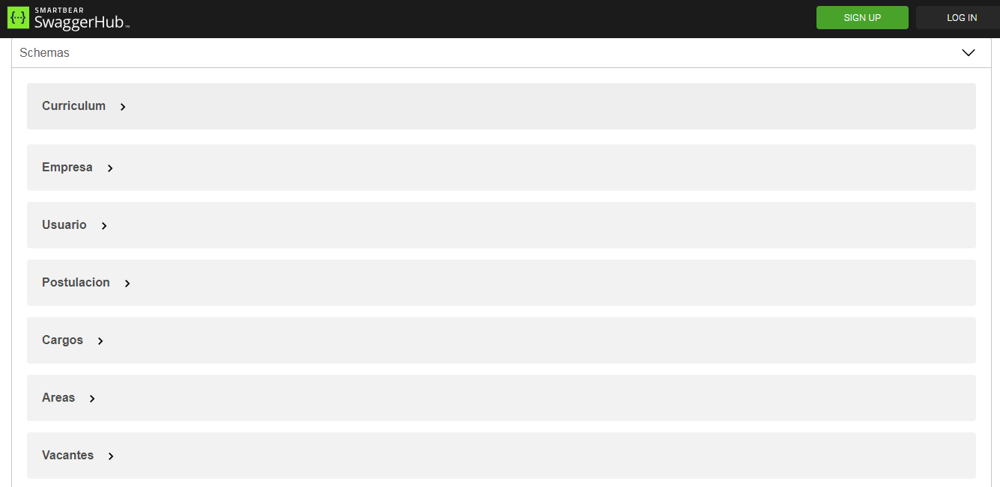
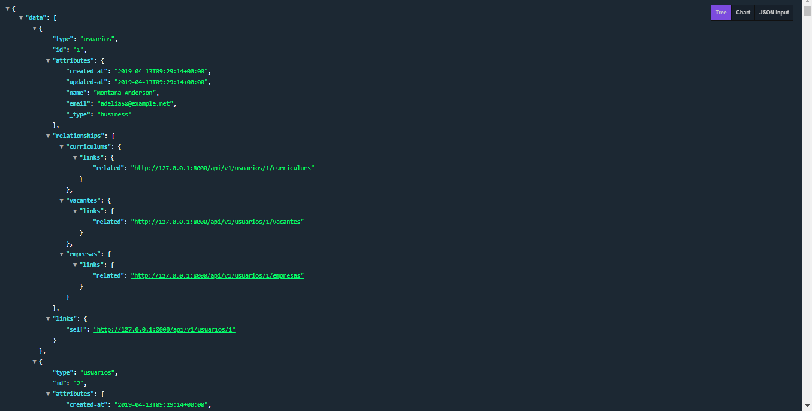
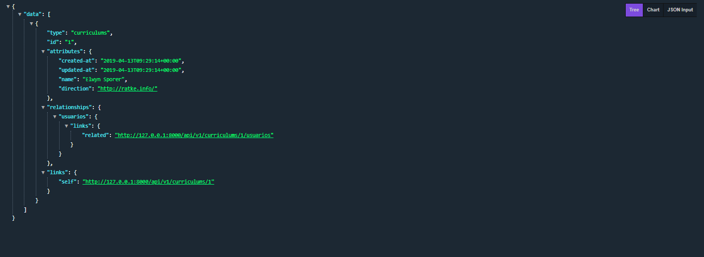

# API REST con Laravel
## Visión general
El objetivo con ese proyecto es crear una API REST usando como base [Laravel](https://laravel.com/) y la librería [Laravel JSON-API](https://laravel-json-api.readthedocs.io/en/latest/) (es una librería que facilita la creación de APIs). La documentación de la API fue creada con [Swagger](https://swagger.io/) y la pueden ver haciendo clic [aquí](https://app.swaggerhub.com/apis-docs/Ackrom/bolsa_empleo/1.0.0). 

La API permitirá recibir y manipular los datos de una  base de datos relacional. La base de datos almacenará la información de una ficticia "bolsa de empleo" (más adelante detallaré de que se trata). 
## Instalación

```
$ git clone https://github.com/Ackrom/API-REST-with-Laravel-5.5.git
$ cd ./bosa_de_trabajo
$ composer install
$ php artisan migrate:install --seed
$ php artisan serve
```
Descargar o clonar el repositorio, ingresar en la carpeta, instalar las dependencias,  correr las migraciones y ejecutar.

NOTA IMPORTANTE: crear el archivo .env para que corra con su base de datos preferida (yo usé PostgreSQL ; ) ).

## La base de datos - Universo del discurso y ER

En este proyecto he decidido crear una API para una página ficticia que se dedicada a publicar ofertas de empleos (like infoJobs, LinkedIn, JobFluent, etc.).

No le he dedicado mucho tiempo al modelado y como era de esperarse hay "detalles" que se podrían "mejorar" (como es el caso de la relación entre usuarios y empresas, o el de las categorías) pero, en general cumple con su propósito.

### Comencemos con el universo del discurso:

*"Un portal de empleo es un sitio web especializado que **integra oferta y demanda laboral** existente en el mercado. El objetivo principal de este espacio, que puede **ser pagado o gratuito**, es ofrecer a sus usuarios un servicio de búsqueda de trabajo en línea, de manera rápida y simple.
El portal de empleo **reúne diversas vacantes** de distintas **empresas e instituciones**, para gran parte de las **áreas y cargos** existentes en el mercado de una **zona geográfica determinada**. Los usuarios por su parte, **ingresan sus currículum** a través de la red, lo que **les permite postular** a los avisos de su interés de manera ilimitada. Estas búsquedas pueden realizarse a partir de distintas **categorías, ya sea ciudad o región, área, tipo de cargo, carrera, entre otras**."*
Wikipedia

Palabras clave:
- Vacantes
- Postulaciones
- Modalidad (pago/gratuito)
- Empresas o instituciones
- Areas
- Cargos
- Zona geográfica
- Curriculum

### Continuemos con el ERD:



## La documentación 


Para la documentación he usado [Swagger](https://swagger.io/)(recomendado... por ahora... 14/04/2019) y pueden acceder a la documentación a través de este enlace:  https://app.swaggerhub.com/apis-docs/Ackrom/bolsa_empleo/1.0.0

Pero para dar una visión general de la estructura de la API aquí unas capturas:




 

& un ejemplo de los resulados



